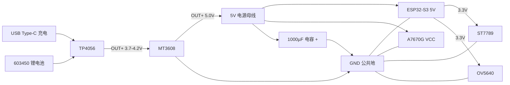

# 扫题挂件 — 硬件安装与组装指南

> **版本**：v1.0  
> **适用方案**：方案 A（100×100×100 mm 立方体外壳）  
> **主控**：ESP32-S3-DevKitC-1 N16R8  
> **目标读者**：首次接触 ESP32、锂电池与 4G 模块的初学者  
> **重要提示**：本文引脚表为**推荐默认值**；若项目固件已定义引脚，**必须以固件代码为准**，本文标注「需与代码一致时可调整」。

---

## 目录

1. [文档概述与 BOM 清单](#1-文档概述与-bom-清单)
2. [所需工具与耗材](#2-所需工具与耗材)
3. [安全须知](#3-安全须知)
4. [开箱验货 Checklist](#4-开箱验货-checklist)
5. [电源子系统组装](#5-电源子系统组装)
6. [推荐引脚接线表](#6-推荐引脚接线表)
7. [分阶段组装步骤](#7-分阶段组装步骤)
8. [MT3608 调压步骤](#8-mt3608-调压步骤)
9. [A7670G SIM 卡安装与 AT 联网测试](#9-a7670g-sim-卡安装与-at-联网测试)
10. [各模块独立测试步骤](#10-各模块独立测试步骤)
11. [3D 外壳安装要点](#11-3d-外壳安装要点)
12. [整机上电与验收 Checklist](#12-整机上电与验收-checklist)
13. [常见问题排查表](#13-常见问题排查表)
14. [建议组装顺序时间线](#14-建议组装顺序时间线)

---

## 1. 文档概述与 BOM 清单

### 1.1 项目概述

扫题挂件是一款约 **10×10×10 cm** 的便携立方体设备，具备：

| 功能 | 硬件 |
|------|------|
| 图像采集 | OV5640 自动对焦摄像头 |
| 本地显示 | ST7789 1.3 寸 240×240 IPS 屏 |
| 蜂窝联网 | A7670G 4G Cat-1 模块（全球版 AT） |
| 主控计算 | ESP32-S3-DevKitC-1（16 MB Flash + 8 MB PSRAM） |
| 供电 | 603450 1200 mAh 锂电 + TP4056 充放保护 + MT3608 升压 |

**推荐组装策略**：先**裸板分模块联调**，确认屏幕、摄像头、4G、按键均正常后，再**叠加固定**并**装入 3D 外壳**。

### 1.2 3D 外壳文件（本目录）

| 文件 | 说明 |
|------|------|
| `saoti_guajian_body.stl` / `.step` | 下壳（主体），高度 **92 mm** |
| `saoti_guajian_lid.stl` / `.step` | 上盖，高度 **8 mm**，含挂绳孔 |
| `generate_enclosure.py` | CadQuery 外壳生成脚本（可重新导出 STL/STEP） |
| `打印说明-给商家.txt` | 发给 3D 打印商家的工艺说明 |

**外轮廓尺寸**：100 × 100 × 100 mm（下壳 92 mm + 上盖 8 mm）  
**内腔尺寸**：约 96 × 96 × 90 mm，壁厚 2 mm  
**坐标系**：原点在立方体**左后下角** — X 向右，Y 向里（深度），Z 向上

### 1.3 已购 BOM 对照表

| 序号 | 模块 | 规格/型号 | 店铺 | 数量 | 备注 |
|------|------|-----------|------|------|------|
| 1 | 主控开发板 | ESP32-S3-DevKitC-1 **N16R8** | 泽杰旗舰店 | 1 | 16 MB Flash + 8 MB OPI PSRAM |
| 2 | 摄像头 | OV5640 **自动对焦**（采购套餐） | 贝科姆 | 1 | 确认排线、镜头保护膜 |
| 3 | 显示屏 | ST7789 **1.3 寸 240×240 IPS**，插接式 **12 Pin 裸屏** | 深超（中景园） | 1 | 无 PCB 转接板，需飞线或自制转接 |
| 4 | 4G 模块 | **A7670G 全球版-AT MCore** + FPC 天线 | 飞思创 | 1 | AT 固件，Nano SIM |
| 5 | 充电模块 | TP4056 **3.7 V 带过充放保护 Type-C** | 天麟 | 1 | 带保护板，非裸 TP4056 |
| 6 | 锂电池 | **603450 1200 mAh** 带保护板 | 科创新能源 | 1 | 尺寸约 6×34×50 mm |
| 7 | 升压模块 | **MT3608** 可调升压 | 电子爱好者之家 | 1 | 输出需调至 5.0 V |
| 8 | 按键 | **2 位独立按键模块**（双键 PCB） | 天猫电子积木款 | 1 | KEY1→GPIO0，KEY2→GPIO42；见 WIRING.md |
| 9 | 杜邦线 | 母对母 **40 P 20 cm** | 跃动芯火 | 1 排 | 建议再备公对母 |
| 10 | 数据线 | Type-C 数据线 **30 cm** | 跃动芯火 | 1 | 充电与串口调试 |
| 11 | 电解电容 | **16 V 1000 µF 8×12** | 深圳顺兴达 | 1 | 抑制 4G 脉冲电流 |

### 1.4 用户自行准备

| 物品 | 用途 |
|------|------|
| Nano SIM / 物联网卡 | A7670G 蜂窝联网（需已激活、有流量） |
| 数字万用表 | MT3608 调压、排查短路 |
| 3D 打印外壳 | 本目录 STL/STEP，PETG/ABS 推荐 |
| （强烈建议）热缩管、电工胶带 | 绝缘与固定 |
| （建议）M3×6 螺丝 + 螺母 | 四角加强固定（见打印说明） |
| （建议）泡棉双面胶 / 3M VHB | 固定电池与天线 |
| （可选）ESP32 USB 串口驱动 | macOS 通常免驱；Windows 需 CP210x/CH340 驱动 |

---

## 2. 所需工具与耗材

### 2.1 必备工具

| 工具 | 用途 |
|------|------|
| 数字万用表 | 测电压、通断、确认极性 |
| 十字/一字小螺丝刀 | 轻触开关、模块端子 |
| 尖嘴钳 | 剥线、折引脚 |
| 侧剪钳 | 剪杜邦线、引脚 |
| USB Type-C 线 | 充电、ESP32 烧录与串口监视 |
| 电脑（Windows/macOS/Linux） | 烧录固件、串口 AT 测试 |

### 2.2 建议工具

| 工具 | 用途 |
|------|------|
| 电烙铁 + 焊锡（含松香） | ST7789 裸屏 12 Pin 飞线更可靠 |
| 热缩管 / 电工胶带 | 防止短路 |
| 扎带 / 双面胶 | 线束整理 |
| 镊子 | 插 SIM 卡、夹小件 |
| 标签纸 / 记号笔 | 标注线序（强烈建议） |
| 手机（手电筒） | 检查壳内是否顶线 |

### 2.3 耗材

| 耗材 | 用量建议 |
|------|----------|
| 杜邦线母对母 | 30～50 根 |
| 1000 µF 电解电容 | 1 个（4G 供电滤波） |
| 热缩管 | 若干 |
| 泡棉垫 | 电池与外壳缓冲 |

---

## 3. 安全须知

> **锂电池操作不当可能导致起火、膨胀或爆炸。请逐条阅读。**

### 3.1 锂电池

1. **极性不可接反**：电池红线/标记 **+** 接 **BAT+ / OUT+**；黑线 **−** 接 **BAT− / OUT−**。接反可能瞬间损坏 TP4056、升压模块及开发板。
2. **禁止短路**：电池正负极、焊点、杜邦线金属部分不可互相触碰。
3. **禁止刺穿、弯折、加热**电池；膨胀/漏液/发热的电池**立即停用**并安全处置。
4. 首次焊接或接线后，用万用表 **直流电压档** 确认电池端约 **3.7～4.2 V**，且无异常发热。
5. 充电请在**通风**环境进行；人不在场时**不要**长时间无人值守充电（尤其首次）。

### 3.2 极性与接地

1. 全机采用**共地**：TP4056、MT3608、ESP32、A7670G、屏幕、摄像头 **GND 必须相连**。
2. 电解电容：**长脚 +** 接 **5 V 正**，**短脚 −** 接 **GND**；焊反可能爆炸。
3. ESP32-S3 的 **3.3 V 逻辑** 不可直接接 **5 V** 到 GPIO（部分模块 TX/RX 需确认电平）。

### 3.3 首次上电流程

```
① 万用表确认 MT3608 空载输出 ≈ 5.0 V
② 断开 A7670G 与摄像头等大电流负载，仅给 ESP32 上电
③ 测量 ESP32 板上 3.3 V 引脚电压正常（约 3.2～3.4 V）
④ 再逐一接入 ST7789 → OV5640 → A7670G
⑤ 每接入一个模块，观察是否发热、重启、屏幕花屏
```

### 3.4 4G 模块特别注意

- A7670G 发射瞬间电流可达 **1～2 A 峰值**，务必：
  - 使用**粗短**电源线（电池 → MT3608 → 负载）
  - 在 **5 V 母线** 近 A7670G 处并联 **1000 µF 电容**
  - 避免仅用 ESP32 板载 3.3 V 给 4G 模块供电

### 3.5 静电与操作

- 触摸金属接地物释放静电后再摸芯片引脚。
- 插拔摄像头排线时**断电**；捏住插头两侧，不要拽排线。

---

## 4. 开箱验货 Checklist

逐项打勾，异常先联系卖家，**不要**带着故障件继续组装。

### 4.1 ESP32-S3-DevKitC-1

- [ ] 板面无裂纹、无元件缺失
- [ ] USB Type-C 口无松动
- [ ] 上电后电源 LED 亮（USB 供电测试）
- [ ] 电脑识别串口（macOS：`/dev/cu.usbmodem*` 或类似）
- [ ] 确认丝印型号含 **N16R8**（16 MB Flash + 8 MB PSRAM）

### 4.2 OV5640 摄像头模块

- [ ] 模组 PCB 完整，镜头有保护盖/膜
- [ ] 排线无折痕、插座卡扣正常
- [ ] 排线方向说明书与插座缺口一致
- [ ] （可选）用万用表测 3.3 V / GND 无短路

### 4.3 ST7789 1.3 寸裸屏

- [ ] 玻璃无裂纹、无大面积划痕
- [ ] 12 Pin 排针无弯折
- [ ] 背面驱动 IC 无虚焊
- [ ] 确认是 **240×240 IPS**（非 240×320 等其他分辨率）

### 4.4 A7670G MCore

- [ ] 模块本体无磕碰
- [ ] **FPC 天线**未撕裂（先不要过度弯折）
- [ ] Nano SIM 卡槽弹簧正常
- [ ] 天线接口已拧紧/插牢（如有 SMA/IPEX 转接）
- [ ] 确认套餐为全球版 **A7670G-AT**

### 4.5 TP4056 充放保护模块

- [ ] Type-C 口正常
- [ ] 标注 **B+ / B− / OUT+ / OUT−** 清晰
- [ ] 充电指示 LED 插入 USB 会亮/变化
- [ ] 保护芯片无烧痕

### 4.6 603450 锂电池

- [ ] 电压约 **3.7～3.9 V**（出厂存储电压）
- [ ] 保护板包覆完整
- [ ] 无鼓包、无异味
- [ ] 尺寸能放入壳体（约 6×34×50 mm）

### 4.7 MT3608 升压模块

- [ ] 可调电位器可旋转
- [ ] IN+/IN−、OUT+/OUT− 标识清晰
- [ ] 先用 USB 或可调电源 **单独测试**（见第 8 章）

### 4.8 轻触开关

- [ ] 按下手感清脆，松手回弹
- [ ] 四脚通断符合预期（对角相通）

### 4.9 1000 µF 电容

- [ ] 引脚无腐蚀
- [ ] 标注 **16 V 1000 µF**
- [ ] 确认 **长脚为正**

---

## 5. 电源子系统组装

### 5.1 系统电源架构

本机采用 **单节 3.7 V 锂电 → 升压 5 V → 各模块** 的架构：

```
                    ┌─────────────────────────────────────────┐
                    │              负载分配                    │
                    │  ESP32-S3 (5V→板载3.3V)                 │
                    │  A7670G MCore (5V 或 VBAT)              │
                    │  OV5640 / ST7789 (3.3V 由 ESP32 引出)   │
                    └─────────────────────────────────────────┘
                                        ▲
                                        │ 5.0 V（调整后）
                    ┌───────────────────┴───────────────────┐
                    │            MT3608 升压模块              │
                    │  IN+ / IN−  ← 电池经 TP4056 保护输出    │
                    │  OUT+ / OUT− → 5V 母线 + 1000µF 到 GND   │
                    └───────────────────┬───────────────────┘
                                        │
                    ┌───────────────────┴───────────────────┐
                    │     TP4056（Type-C 充放保护一体）       │
                    │  B+ / B−  ←→  603450 电池              │
                    │  OUT+ / OUT− → 整机电池正/负母线        │
                    │  USB-C ← 外部充电                        │
                    └───────────────────────────────────────┘
```

### 5.2 接线表（电源部分）

| 从 | 到 | 线色建议 | 说明 |
|----|----|----------|------|
| 电池 **+** | TP4056 **B+** | 红 | 先不要插电池，最后确认再接入 |
| 电池 **−** | TP4056 **B−** | 黑 | 共地基准 |
| TP4056 **OUT+** | MT3608 **IN+** | 红 | 受保护电池正 |
| TP4056 **OUT−** | MT3608 **IN−** | 黑 | 电池负/系统地 |
| MT3608 **OUT+** | 5 V 母线（红） | 红 | **调压至 5.0 V 后再接负载** |
| MT3608 **OUT−** | GND 母线（黑） | 黑 | 全机共地 |
| 5 V 母线 | ESP32 **5V** 或 **VIN** | 红 | DevKitC-1 可从 5V 引脚供电 |
| 5 V 母线 | A7670G **VCC/5V** | 红 | 以模块丝印为准 |
| GND 母线 | ESP32 **GND** | 黑 | 至少 2 根降低阻抗 |
| GND 母线 | A7670G **GND** | 黑 | 粗短为佳 |
| 1000 µF **+** | 5 V 母线 | — | 靠近 A7670G |
| 1000 µF **−** | GND 母线 | — | 注意极性 |

> **TP4056 OUT 与 BAT 关系**：带保护板模块的 **OUT+/OUT−** 为对外供电端；充电时仍可从 OUT 取电，但大电流 4G 发射时电压会跌落，务必加 **1000 µF** 并缩短路径。

### 5.3 ASCII 接线图

```
  [USB Type-C 充电器]
         │
         ▼
  ┌──────────────┐
  │   TP4056     │
  │  B+    B−    │◄─── [603450 电池 + −]
  │  OUT+ OUT−   │───┐
  └──────────────┘   │
                     │ 3.7～4.2 V
                     ▼
              ┌─────────────┐
              │   MT3608    │
              │ IN+    IN−  │
              │ OUT+  OUT−  │─── 5.0 V ───┬─── ESP32 5V
              └─────────────┘             ├─── A7670G VCC
                     │                    │
                    GND ═════════════════╪═══ ESP32 GND
                                           ╪═══ A7670G GND
                                           │
                                      ┌────┴────┐
                                      │1000µF   │
                                      │ + −     │
                                      └─────────┘
```

### 5.4 Mermaid 接线图（可选渲染）



### 5.5 电源子系统分步操作

**步骤 5.1** — 在面包板或硬纸板上规划 **5 V 母线** 与 **GND 母线**，不要全部挤在 ESP32 排针上。

**步骤 5.2** — 焊接/拧紧 TP4056 与 MT3608 的进出线；暂时**不接** ESP32 与 A7670G。

**步骤 5.3** — 接入电池前，万用表测 TP4056 的 B+/B− 对 OUT+/OUT− 无异常短路（新电池约 3.7 V）。

**步骤 5.4** — 按 [第 8 章](#8-mt3608-调压步骤) 将 MT3608 **空载**调至 **5.0 V**。

**步骤 5.5** — 在 5 V 与 GND 之间焊接 **1000 µF 电容**（可先不焊 ESP32 侧）。

**步骤 5.6** — 给 ESP32 单独供电测试（5 V + GND），确认板载 3.3 V 正常。

**步骤 5.7** — 最后接入 A7670G 电源，观察 TP4056 / MT3608 是否异常发热。

---

## 6. 推荐引脚接线表

> **说明**：工作区中未发现已烧录固件/引脚头文件，下表基于 ESP32-S3 + OV5640（esp32-camera 常见 DVP 映射）+ ST7789 SPI + A7670G UART 的**常用接法**。  
> **若后续固件已定义 `pins.h` / `board_config.h`，以代码为准**；调整引脚后需同步修改固件并重新编译烧录。

### 6.1 引脚分配总览

| 功能 | 信号 | 推荐 GPIO | ESP32-S3 引脚位置提示 | 备注 |
|------|------|-----------|----------------------|------|
| **ST7789** | MOSI (SDA) | **11** | 右侧排针 | SPI 数据（需与代码一致时可调整） |
| | SCLK (SCL) | **12** | 右侧排针 | SPI 时钟 |
| | CS | **10** | 右侧排针 | 片选，低有效 |
| | DC (RS) | **14** | 左侧排针 | 数据/命令 |
| | RST | **21** | 左侧排针 | 复位 |
| | BL (背光) | **47** | 底部/排针 | 高电平点亮；可 PWM |
| **OV5640** | XCLK | **15** | — | 主时钟 |
| | SIOD (SDA) | **4** | — | SCCB/I²C 数据 |
| | SIOC (SCL) | **5** | — | SCCB/I²C 时钟 |
| | D0～D7 | **8,9,10,11,12,13,16,17** | — | 8 位并行数据；**与屏幕 SPI 有冲突** |
| | VSYNC | **6** | — | 帧同步 |
| | HREF | **7** | — | 行有效 |
| | PCLK | **18** | — | 像素时钟 |
| | PWDN | **NC** | — | 未接则模块内部上拉 |
| | RESET | **NC** | — | 未接则模块内部上拉 |
| **A7670G** | ESP32 RX ← 模块 TX | **44** | UART RX | 交叉连接 |
| | ESP32 TX → 模块 RX | **43** | UART TX | 交叉连接 |
| | PWRKEY | **41** | 输出 | 开机：拉低 ≥1 s（以模块手册为准） |
| | RESET | **42** | 输出 | 可选，低复位 |
| | NET_STATUS | **2** | 输入 | 可选，读联网 LED 状态 |
| **按键** | BTN → GND | **0** | 带内部上拉 | 拍照键；**GPIO0 为 Strapping**，若影响启动可改 **1** 或 **3** |
| **电源** | 3.3 V | **3V3** | 排针 | 供屏幕、摄像头（注意总电流） |
| | GND | **GND** | 多根并联 | 共地 |

### 6.2 ⚠️ 重要：摄像头与屏幕引脚冲突

OV5640 的 **DVP 8 位并行** 会占用大量 GPIO，与上表 ST7789 的 **10/11/12** 存在重叠。常见解决方案：

1. **固件方案 A（推荐）**：使用 esp32-camera 官方 S3 引脚包，ST7789 改接 **35～40** 等空闲脚（需改代码）。
2. **固件方案 B**：摄像头与屏幕**分时复用**部分引脚（高级，需专用驱动）。
3. **硬件方案**：选用带独立 SPI 且引脚已隔离的 **摄像头+屏幕一体板**（本项目为分立模块，需软件协调）。

**折中推荐（供固件开发参考，需与代码一致时可调整）**：

| 功能 | 推荐 GPIO |
|------|-----------|
| ST7789 MOSI | **35** |
| ST7789 SCLK | **36** |
| ST7789 CS | **37** |
| ST7789 DC | **38** |
| ST7789 RST | **39** |
| ST7789 BL | **40** |
| OV5640 | 按 esp32-camera `camera_pins.h` 中 **ESP32S3_EYE** 或 **CUSTOM** 模板 |

### 6.3 ST7789 裸屏 12 Pin 常见定义

不同卖家线序可能不同，**以商家资料为准**；常见顺序如下（面向屏幕背面，从左到右）：

| Pin | 名称 | 接 ESP32 |
|-----|------|----------|
| 1 | GND | GND |
| 2 | VCC | 3.3 V |
| 3 | SCL | SCLK |
| 4 | SDA | MOSI |
| 5 | RES | RST |
| 6 | DC | DC |
| 7 | CS | CS |
| 8 | BL | BL（3.3 V 或 GPIO） |
| 9～12 | NC/备用 | 不接 |

> 若线序不同：用万用表通断档对照商家图，**切勿**把 VCC 接到信号脚。

### 6.4 OV5640 模块

| 模块引脚 | 接 ESP32 |
|----------|----------|
| 3.3 V | 3.3 V |
| GND | GND |
| SCCB / I²C | SIOD→GPIO4, SIOC→GPIO5 |
| D0～D7, VSYNC, HREF, PCLK, XCLK | 见 6.1 表 |

排线：**金属触点朝向 PCB**，插入后扣紧卡扣。

### 6.5 A7670G MCore

| 模块引脚 | 接 ESP32 / 电源 |
|----------|-----------------|
| VCC / 5V | 5 V 母线（**不要**从 3.3 V 取电） |
| GND | GND |
| TXD | ESP32 **GPIO44 (RX)** |
| RXD | ESP32 **GPIO43 (TX)** |
| PWRKEY | GPIO41（通过 1kΩ 限流可选） |
| RESET | GPIO42 或悬空 |
| 天线 | FPC 天线贴盖非金属区 |

### 6.6 轻触开关（拍照键）

```
GPIO0 ──── 开关一脚
GND   ──── 开关另一脚（对角）
```

固件配置：`INPUT_PULLUP`，按下为 **LOW**。

### 6.7 完整接线示意（ASCII）

```
                    ┌──────────────── ESP32-S3-DevKitC-1 ────────────────┐
                    │                                                   │
   ST7789           │  3.3V ──────────────────── VCC                      │
   ┌────────┐       │  GND ──────────────────── GND                      │
   │ 240×240│◄──────┤  GPIO35-40 ───────────── SPI (MOSI/SCLK/CS/DC/RST/BL) │
   └────────┘       │                                                   │
                    │  GPIO4,5,6,7,8-18 ────── OV5640 DVP + SCCB       │
   OV5640           │                                                   │
   ┌────────┐       │  3.3V / GND ────────────── 摄像头供电             │
   │ AF     │◄──────┤                                                   │
   └────────┘       │  GPIO43 TX ─────────────► A7670 RXD                │
                    │  GPIO44 RX ◄──────────── A7670 TXD                │
   A7670G           │  GPIO41 ───────────────► PWRKEY                   │
   ┌────────┐       │  5V / GND ─────────────── 模块电源 + 1000µF      │
   │ 4G     │◄──────┤                                                   │
   └────────┘       │  GPIO0 ────[按键]─── GND                          │
                    │  5V ◄────────────────── MT3608 OUT+               │
                    └───────────────────────────────────────────────────┘
```

---

## 7. 分阶段组装步骤

### 阶段 0：规划与标注（约 30 分钟）

**步骤 0.1** — 打印或手抄 [第 6 章](#6-推荐引脚接线表) 引脚表，贴在工作台。

**步骤 0.2** — 给每根杜邦线贴标签（如 `SCL`、`MOSI`、`4G_TX`）。

**步骤 0.3** — 确认 3D 外壳已打印，USB 口、SIM 口、按键孔可试装（可先不放电子件）。

---

### 阶段 1：电源子系统（约 1 小时）

**步骤 1.1** — 按 [第 5 章](#5-电源子系统组装) 完成 TP4056 + 电池 + MT3608 + 电容。

**步骤 1.2** — 完成 [第 8 章](#8-mt3608-调压步骤) 调压，空载 **5.0 V**。

**步骤 1.3** — 仅连接 ESP32 的 **5V + GND**，上电测 3.3 V 引脚。

**验收**：ESP32 电源 LED 亮，无发热，万用表 3.3 V 正常。

---

### 阶段 2：裸板联调 — 屏幕（约 45 分钟）

**步骤 2.1** — ST7789 12 Pin 用杜邦线或焊接连至 ESP32（见 6.3）。

**步骤 2.2** — 烧录**屏幕测试固件**（Arduino `TFT_eSPI` 或厂家示例），确认 240×240 显示正常。

**步骤 2.3** — 背光不亮：交换 BL 接 **3.3 V** 常亮测试，或检查 GPIO 电平。

**验收**：纯色填充、文字、方向正确，无花屏/白屏。

---

### 阶段 3：裸板联调 — 摄像头（约 45 分钟）

**步骤 3.1** — 断电接 OV5640 排线。

**步骤 3.2** — 烧录 **esp32-camera** 示例（OV5640 自动检测或指定传感器）。

**步骤 3.3** — 串口查看是否识别 `OV5640`，能否输出 JPEG 大小 > 0。

**验收**：串口或网页看到清晰图像，自动对焦近距清晰。

---

### 阶段 4：裸板联调 — 4G（约 1 小时）

**步骤 4.1** — A7670G 接 5V/GND/UART/PWRKEY，**先不装壳**。

**步骤 4.2** — 按 [第 9 章](#9-a7670g-sim-卡安装与-at-联网测试) 插 SIM、发 AT 指令。

**步骤 4.3** — 确认 `AT+CPIN?` 返回 READY，`AT+CSQ` 有信号。

**验收**：`AT+CGATT=1` 附着成功，可 `AT+CIFSR` 或 PDP 激活（依运营商）。

---

### 阶段 5：裸板联调 — 按键（约 15 分钟）

**步骤 5.1** — GPIO0 与 GND 接轻触开关。

**步骤 5.2** — 烧录简单 GPIO 中断例程，串口打印按下/松开。

**验收**：每次按下串口有输出，无抖动可软件消抖。

---

### 阶段 6：模块叠加与理线（约 1～2 小时）

**步骤 6.1** — 将 ESP32、A7670、TP4056、MT3608 用双面胶或尼龙柱固定在壳内**非金属**区域。

**步骤 6.2** — 电池贴于壳体一侧，**避免**顶到摄像头排线；出线朝 TP4056。

**步骤 6.3** — 线束沿壳壁走线，避开 SIM 卡槽活动路径。

**步骤 6.4** — 用扎带/胶带分区：**电源线粗短**，**信号线远离天线**。

**步骤 6.5** — 可选：下壳四角 M3 柱（见 `generate_enclosure.py`）固定主控。

---

### 阶段 7：装壳（约 45 分钟）

**步骤 7.1** — 屏幕从内侧对准正面 **34×34 mm** 窗口，用胶固定 PCB/排针侧。

**步骤 7.2** — 摄像头对准 **36×24 mm** 窗口，镜头与孔同心。

**步骤 7.3** — 轻触开关对准右侧 **Ø12 mm** 孔，可加小帽提高手感。

**步骤 7.4** — TP4056 Type-C 与底部 **12×5 mm** 口对齐，可热熔胶限位。

**步骤 7.5** — A7670G SIM 槽与左侧 **16×3 mm** 口对齐。

**步骤 7.6** — FPC 天线贴于上盖内侧浅槽（**70×24 mm 区域**，非金属）。

**步骤 7.7** — 合盖前再次检查无短路、无顶线；上盖插扣后可选 M3 四角加固。

**验收**：外观孔位对齐，按键可按，SIM 可插拔，Type-C 可充电。

---

## 8. MT3608 调压步骤

### 8.1 所需条件

- 数字万用表（直流电压档）
- 电池或 TP4056 OUT 提供 **3.7～4.2 V** 输入（**勿用 USB 5 V 直灌 IN** 除非确认模块允许）
- **先断开** OUT 侧所有负载（ESP32、A7670G 均未接）

### 8.2 操作步骤

| 步骤 | 操作 | 预期结果 |
|------|------|----------|
| 1 | MT3608 **IN+** 接 TP4056 **OUT+**，**IN−** 接 **OUT−** | 输入约 3.7～4.2 V |
| 2 | 万用表红表笔接 **OUT+**，黑表笔接 **OUT−** | 读数可能为 5 V 默认值或随机 |
| 3 | **顺时针/逆时针**缓慢旋转电位器，观察读数变化 | 找到可调范围 |
| 4 | 调至 **5.00 V ± 0.05 V** | 空载稳定 5.0 V |
| 5 | 接入 ESP32，再测 OUT 电压 | 负载下 ≥ 4.85 V 可接受 |
| 6 | 再接入 A7670G，发 `AT` 测试 | 电压不明显跌落；若 < 4.5 V 需检查线径/电容 |

### 8.3 注意事项

1. **先调压，后接负载** — 过高电压（> 5.5 V）可能损坏 ESP32 与 4G 模块。
2. 电位器为 **多圈** 时，微调耐心旋转。
3. 若输出电压**不受控**或输入发热 → 立即断电，检查 IN/OUT 是否接反。
4. 负载接入后压降大 → 加粗电源线、补 **1000 µF**、缩短路径。

---

## 9. A7670G SIM 卡安装与 AT 联网测试

### 9.1 SIM 卡安装

1. **完全断电**。
2. 确认卡为 **Nano SIM**（小卡），方向以卡槽丝印为准（缺角对齐）。
3. 从壳体左侧 **16×3 mm** 槽用镊子推入/弹出（弹簧卡槽）。
4. 插入时听到/感到卡扣到位。

### 9.2 硬件连接检查

| 项目 | 检查 |
|------|------|
| 5 V 供电 | 模块电源 LED 可能闪烁/常亮（视固件） |
| TX/RX | **交叉**：模块 TX → ESP32 RX(44)，模块 RX ← ESP32 TX(43) |
| GND | 与 ESP32 共地 |
| 天线 | FPC 已接，远离金属屏蔽 |

### 9.3 开机时序（PWRKEY）

多数 A7670 系列：

1. 上电后，**PWRKEY 拉低 ≥ 1 秒** 再释放 → 模块开机。
2. 或用 AT 工具自动拉 PWRKEY（固件实现）。

### 9.4 AT 测试（USB 串口监视器或独立 USB-TTL）

**串口参数**：115200, 8N1（部分默认 9600，无响应则切换）

| 序号 | 发送指令 | 期望响应 | 说明 |
|------|----------|----------|------|
| 1 | `AT` | `OK` | 通信正常 |
| 2 | `ATE0` | `OK` | 关闭回显 |
| 3 | `AT+CPIN?` | `+CPIN: READY` | SIM 就绪 |
| 4 | `AT+CSQ` | `+CSQ: xx,yy` | 信号；xx=99 表示无信号 |
| 5 | `AT+CREG?` | `0,1` 或 `0,5` | 网络注册 |
| 6 | `AT+CGATT=1` | `OK` | 附着 GPRS/PS |
| 7 | `AT+CGDCONT=1,"IP","APN"` | `OK` | APN 替换成运营商 APN |
| 8 | `AT+NETOPEN` 或 PDP 激活指令 | `OK` | 依 AT 手册版本 |

**常见 APN（中国大陆，以运营商客服为准）**：

| 运营商 | APN |
|--------|-----|
| 中国移动 | `cmnet` 或 `cmiot`（物联卡） |
| 中国联通 | `3gnet` 或 `scuiot` |
| 中国电信 | `ctnet` 或 `ctnb` |

### 9.5 无响应排查

- 交换 TX/RX 再试
- 改波特率 9600 ↔ 115200
- 确认 PWRKEY 已开机
- 测 5 V 是否在 4.5～5.5 V

---

## 10. 各模块独立测试步骤

### 10.1 ST7789 屏幕

| 步骤 | 操作 | 通过标准 |
|------|------|----------|
| 1 | 仅接 3.3V/GND/SPI 六线 | 无 smoke |
| 2 | 烧录 TFT 例程 | 有背光 |
| 3 | 显示红绿蓝 | 颜色正常 |
| 4 | 旋转测试 | 方向与外壳窗口一致 |

### 10.2 OV5640 摄像头

| 步骤 | 操作 | 通过标准 |
|------|------|----------|
| 1 | 断电插排线 | 卡扣锁紧 |
| 2 | 烧录 CameraWebServer 或厂家例程 | 串口无 panic |
| 3 | 串口打印传感器名 OV5640 | 识别正确 |
| 4 | 拍照 JPEG | 文件 > 5 KB，非全黑/全绿 |
| 5 | 近距对焦 | 文字清晰 |

### 10.3 A7670G 4G

| 步骤 | 操作 | 通过标准 |
|------|------|----------|
| 1 | 5V + 1000µF | 电压稳定 |
| 2 | AT 通信 | 返回 OK |
| 3 | SIM READY | CPIN READY |
| 4 | CSQ > 10 | 信号可用 |
| 5 | 注册网络 | CREG 1 或 5 |

### 10.4 按键

| 步骤 | 操作 | 通过标准 |
|------|------|----------|
| 1 | 万用表通断档 | 按下导通 |
| 2 | GPIO 例程 | 按下串口输出 |
| 3 | 装壳后 | 孔位可按下 |

---

## 11. 3D 外壳安装要点

依据 `generate_enclosure.py` 与 `打印说明-给商家.txt`：

### 11.1 外壳规格摘要

| 项目 | 数值 |
|------|------|
| 外尺寸 | 100 × 100 × 100 mm |
| 下壳高度 | 92 mm |
| 上盖高度 | 8 mm |
| 壁厚 | 2 mm |
| 内腔 | ≈ 96 × 96 × 90 mm |
| 上盖配合 | 内唇 96 × 96 mm 插扣 |

### 11.2 开孔对照表

| 位置 | 尺寸 | 中心坐标 (X, Y, Z) | 安装要点 |
|------|------|-------------------|----------|
| **正面** 摄像头窗 | 36 × 24 mm | (30, 0, 70) | 镜头居中，避免塑料挡光 |
| **正面** 屏幕窗 | 34 × 34 mm | (79, 0, 52) | 屏幕应用泡棉压边防漏光 |
| **右面** 按键孔 | **Ø12 mm** | (100, 50, 28) | 轻触开关 + 可选键帽 |
| **左面** SIM 口 | 16 × 3 mm | (0, 18, 50) | 与 A7670G 卡槽对齐 |
| **底面** USB-C | 12 × 5 mm | (50, 10, 0) | TP4056 口对准，留插线空间 |
| **顶面** 挂绳孔 | Ø≈4.4 mm | (50, 8, 100) | 穿绳后打结在内侧 |
| **顶面内侧** 天线区 | 浅槽 70 × 24 mm | (50, 72, 顶) | FPC 天线贴此，**远离金属/电池** |

### 11.3 内部布局建议（俯视图 ASCII）

```
        Y（向里）
        ↑
        │    ┌─────────────────────────┐
        │    │ [摄像头窗]    [屏幕窗]   │  ← 正面 Y=0
        │    │                         │
        │    │   ESP32 + OV5640        │
        │    │         A7670G →SIM左侧│
        │    │  [电池]  TP4056+MT3608  │
        │    │      USB-C ↓ 底面       │
        └────┴─────────────────────────┴→ X（向右）
```

### 11.4 打印与材料

- 材料：**PETG** 或 **ABS**（耐温更好）；原型可用 PLA
- 填充：**20%～30%**，层高 **0.2 mm**
- **Scale = 100%**，勿缩放
- 下壳 USB 口可能需要**少量支撑**

### 11.5 固定建议

- 下壳四角 **M3 柱**（孔径 3.2 mm）可固定主控
- 电池用 **双面胶 + 泡棉** 固定，防止晃动撞击
- 合盖前确认 **FPC 天线不被夹断**

---

## 12. 整机上电与验收 Checklist

### 12.1 装壳前最后检查

- [ ] 无裸露导线短接
- [ ] 电池极性正确
- [ ] MT3608 输出 5.0 V
- [ ] 1000 µF 极性正确
- [ ] 摄像头排线、SIM 方向正确
- [ ] 天线已连接

### 12.2 首次整机通电

| 顺序 | 动作 | 观察 |
|------|------|------|
| 1 | 不接 USB 充电器，按电源/按键开机 | 屏幕亮、无异味 |
| 2 | 测 TP4056 / MT3608 温度 | 微温正常，烫手则断电 |
| 3 | 插入 USB 充电 | 充电 LED 正常 |
| 4 | 测试拍照 + 联网 | 功能完整 |

### 12.3 功能验收

- [ ] 屏幕显示正常，无漏光
- [ ] 摄像头成像清晰，对焦正常
- [ ] 按键触发拍照/扫题逻辑
- [ ] 4G 注册，可上传或 AT 拨测
- [ ] Type-C 充电正常，充满后截止
- [ ] 挂绳可靠，整机无 rattling
- [ ] 连续运行 30 分钟无重启、无过热

---

## 13. 常见问题排查表

| 现象 | 可能原因 | 处理步骤 |
|------|----------|----------|
| 上电无反应 | 电池没电/保护板锁死 | USB 充电 10 min；测 OUT 电压 |
| | MT3608 无输出 | 查 IN 电压；重新调 5 V |
| | ESP32 5V 未接 | 查 5V/GND 杜邦线 |
| ESP32 反复重启 | 5 V 过高/过低 | 万用表测 MT3608 OUT |
| | 4G 峰值压垮电源 | 加 1000µF、缩短线 |
| 屏幕白屏/花屏 | 线序错误 | 对照 6.3 节重接 |
| | SPI 引脚与代码不符 | 改引脚或改固件 |
| 屏幕无背光 | BL 未接或 GPIO 低 | BL 接 3.3V 或改 PWM |
| 摄像头未识别 | 排线反/松 | 重插排线 |
| | DVP 引脚冲突 | 按 6.2 节调整映射 |
| 图像全绿/黑 | 镜头膜未撕 | 撕膜 |
| | 光线不足 | 增加环境光 |
| AT 无响应 | TX/RX 未交叉 | 对调 TX/RX |
| | 波特率不对 | 试 9600/115200 |
| | 模块未开机 | PWRKEY 拉低 1 s |
| SIM 失败 | 卡未插好/APN 错 | 重插卡；查 APN |
| | 物联卡未激活 | 运营商平台激活 |
| CSQ=99 | 天线未接/金属遮挡 | 天线贴顶盖浅槽 |
| | 室内信号弱 | 靠窗测试 |
| 充电不进 | Type-C 口假 | 换线、换充电器 |
| | TP4056 损坏 | 测 USB 5V 到模块 |
| 整机发热 | 短路 | 立即断电，查线 |
| | 4G 长时间发射 | 检查信号弱导致高功率 |
| 合盖后按键无手感 | 开关未对准 | 重新固定位置 |
| | 键程不足 | 加键帽或垫片 |

---

## 14. 建议组装顺序时间线

适合**单日或两个半天**完成，含打印外壳等待时间另计。

| 阶段 | 内容 | 建议时长 | 累计 |
|------|------|----------|------|
| **D0** | 3D 打印下单 / 等待 | — | — |
| **D1 上午** | 开箱验货（第 4 章） | 0.5 h | 0.5 h |
| | 电源子系统 + MT3608 调压（第 5、8 章） | 1.5 h | 2 h |
| **D1 下午** | ST7789 独立测试（10.1） | 1 h | 3 h |
| | OV5640 独立测试（10.2） | 1 h | 4 h |
| | 按键测试（10.4） | 0.25 h | 4.25 h |
| **D2 上午** | A7670G SIM + AT 测试（第 9 章） | 1.5 h | 5.75 h |
| | 全功能联调（固件集成） | 1 h | 6.75 h |
| **D2 下午** | 理线、固定、试装壳（第 7 阶段 6～7） | 2 h | 8.75 h |
| | 整机验收（第 12 章） | 0.5 h | **≈ 9～10 h** |

### 14.1 最小可行路径（赶时间）

若已有现成固件，可压缩为：

```
电源调压(1h) → 屏幕(0.5h) → 摄像头(0.5h) → 4G(1h) → 装壳(1.5h) ≈ 4.5h
```

### 14.2 不建议跳过的步骤

1. **MT3608 空载调压** — 跳过易烧板  
2. **分模块测试** — 跳过装壳后难以排查  
3. **1000 µF 电容** — 跳过 4G 易 brownout 重启  
4. **SIM/天线装壳前测试** — 跳过可能反复拆壳  

---

## 附录 A：ESP32-S3-DevKitC-1 快速参考

- **供电**：USB Type-C **或** 5V 引脚 + GND（推荐 5V 来自 MT3608）
- **3.3 V 输出**：排针 3V3，最大约 **700 mA**（含 PSRAM/Wi-Fi 峰值），**不宜**单独供 A7670G
- **Strapping 引脚**：GPIO0、GPIO3、GPIO45、GPIO46 — 外接电路避免强上下拉影响下载模式
- **烧录**：按住 **BOOT**，点 **RESET**，进入下载模式（部分板自动 USB 下载）

## 附录 B：文档修订记录

| 版本 | 日期 | 说明 |
|------|------|------|
| v1.0 | 2026-07-03 | 首版：基于已购 BOM + 3D 外壳 generate_enclosure.py |

---

**文档路径**：`/Users/linminhao/Documents/saoti-guajian-3d/ASSEMBLY.md`  
**相关文件**：同目录 `打印说明-给商家.txt`、`generate_enclosure.py`、`saoti_guajian_*.step`

如有固件引脚定义文件，请将其路径告知维护者，以便更新第 6 章为**与代码完全一致**的版本。
